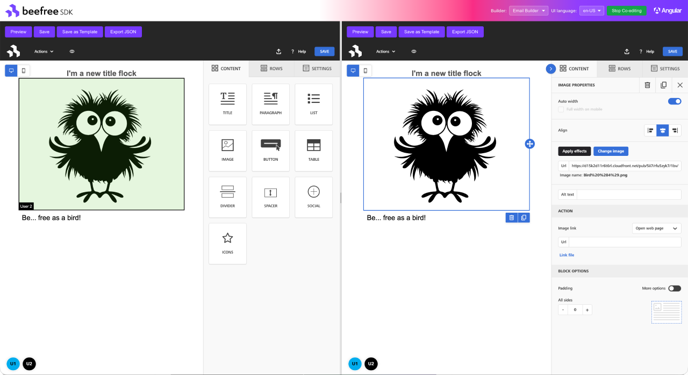

# Beefree SDK Angular Component Library

[](https://www.npmjs.com/package/@beefree.io/angular-email-builder)
[](https://opensource.org/licenses/Apache-2.0)
[](https://www.typescriptlang.org/)
[](https://angular.dev/)

An Angular wrapper library for the [Beefree SDK](https://www.beefree.io/), providing standalone components and an injectable service to embed the Beefree email/page/popup builder into your Angular applications.



## Table of Contents

- [What is Beefree SDK?](#what-is-beefree-sdk)
- [Overview](#overview)
- [Compatibility](#compatibility)
- [Installation](#installation)
- [Quick Start](#quick-start)
- [API Reference](#api-reference)
- [Service](#service)
- [Best Practices](#best-practices)
- [Advanced Usage](#advanced-usage)
- [Examples](#examples)
- [FAQ](#faq)
- [Development](#development)
- [Other Frameworks](#other-frameworks)
- [License](#license)

## What is Beefree SDK?

[Beefree SDK](https://www.beefree.io/) is a drag-and-drop visual content builder that lets your users design professional emails, landing pages, and popups — without writing code. It powers thousands of SaaS applications worldwide, offering a white-label, embeddable editing experience with real-time collaborative editing, responsive design output, and extensive customization options.

This Angular package provides standalone builder components and a `BeefreeService` that handle SDK initialization, lifecycle management, and configuration updates — giving you an Angular-native API to integrate the full Beefree editing experience into your application.

## Overview

### Features

- 🎯 **Angular-Native Integration** — Standalone components with signal-based `input()` / `output()` bindings
- 💉 **Dependency Injection** — `BeefreeService` for programmatic builder control via Angular DI
- 🔄 **Dynamic Configuration** — Update builder configuration on the fly via reactive `effect()`
- 👥 **Collaborative Editing** — Built-in support for shared/collaborative sessions
- 📦 **TypeScript Support** — Full TypeScript definitions with SDK type re-exports
- 🧩 **Multi-Instance** — Run multiple builders on the same page with automatic instance management

## Compatibility

| Requirement | Version |
|-------------|---------|
| Angular | 20+ |
| Node.js | >= 18.0.0 |
| TypeScript | >= 5.5 (recommended) |
| Browsers | Chrome, Firefox, Safari, Edge (latest 2 versions) |

## Installation

```bash
npm install @beefree.io/angular-email-builder @beefree.io/sdk
# or
yarn add @beefree.io/angular-email-builder @beefree.io/sdk
```

## Quick Start

### 1. Get your credentials

Sign up at [developers.beefree.io](https://developers.beefree.io) to get your `client_id` and `client_secret`.

### 2. Set up token generation on your backend

Your backend server should exchange credentials for a short-lived token (see [Security: Server-Side Token Generation](#-security-server-side-token-generation) below for details):

```javascript
// Example: Node.js/Express backend endpoint
app.post('/api/beefree/token', async (req, res) => {
  const response = await fetch('https://auth.getbee.io/loginV2', {
    method: 'POST',
    headers: { 'Content-Type': 'application/json' },
    body: JSON.stringify({
      client_id: process.env.BEEFREE_CLIENT_ID,
      client_secret: process.env.BEEFREE_CLIENT_SECRET,
      grant_type: 'password',
    }),
  })
  res.json(await response.json())
})
```

### 3. Integrate the builder in your Angular app

```typescript
import { Component, OnInit, inject, signal } from '@angular/core'
import { BeefreeBuilder, BeefreeService } from '@beefree.io/angular-email-builder'
import type { IToken } from '@beefree.io/angular-email-builder'

@Component({
  selector: 'app-email-editor',
  standalone: true,
  imports: [BeefreeBuilder],
  template: `
    @if (!token()) {
      <div>Loading builder...</div>
    } @else {
      <div class="controls">
        <button (click)="save()">Save</button>
        <button (click)="preview()">Preview</button>
      </div>
      <lib-beefree-builder
        [token]="token()!"
        [config]="builderConfig"
        [width]="'100%'"
        [height]="'600px'"
        (bbSave)="onSave($event)"
        (bbError)="onError($event)" />
    }
  `,
})
export class EmailEditorComponent implements OnInit {
  private beefreeService = inject(BeefreeService)

  token = signal<IToken | null>(null)

  builderConfig = {
    uid: 'user-123',
    container: 'bee-container',
    language: 'en-US',
  }

  async ngOnInit() {
    const res = await fetch('/api/beefree/token', { method: 'POST' })
    this.token.set(await res.json())
  }

  save() {
    this.beefreeService.save()
  }

  preview() {
    this.beefreeService.preview()
  }

  onSave(event: unknown) {
    console.log('Saved:', event)
  }

  onError(error: unknown) {
    console.error('Builder error:', error)
  }
}
```

## API Reference

### Builder Components

The library provides a single standalone component. The builder type (email, page, popup, or file manager) is determined by the SDK configuration and your application credentials, not by the component itself.

| Component | Selector |
|-----------|----------|
| `BeefreeBuilder` | `lib-beefree-builder` |

### Inputs

| Input | Type | Required | Default | Description |
|-------|------|----------|---------|-------------|
| `token` | `IToken` | Yes | — | Authentication token from Beefree API |
| `config` | `IBeeConfig` | No | `{ container: 'beefree-sdk-container' }` | Beefree SDK configuration object |
| `template` | `IEntityContentJson` | No | `null` | Initial template JSON to load |
| `width` | `string` | No | `'100%'` | Container width (CSS value) |
| `height` | `string` | No | `'100%'` | Container height (CSS value) |
| `shared` | `boolean` | No | `false` | Enable collaborative editing session |
| `sessionId` | `string` | No | `null` | Session ID to join (for collaborative editing) |
| `loaderUrl` | `string` | No | `null` | Custom Beefree SDK loader URL |
| `bucketDir` | `string` | No | `undefined` | Custom storage bucket directory |

### Outputs

Outputs use a `bb` (Beefree Builder) prefix to avoid collisions with native DOM events. Bind them in templates like `(bbSave)="handleSave($event)"`.

| Output | Corresponds to | Description |
|--------|---------------|-------------|
| `bbAutoSave` | `onAutoSave` | Auto-save triggered |
| `bbChange` | `onChange` | Content changed |
| `bbComment` | `onComment` | Comment action |
| `bbError` | `onError` | Error occurred |
| `bbInfo` | `onInfo` | Informational event |
| `bbLoad` | `onLoad` | Builder content loaded |
| `bbLoadWorkspace` | `onLoadWorkspace` | Workspace loaded |
| `bbPreview` | `onPreview` | Preview opened |
| `bbPreviewChange` | `onPreviewChange` | Preview content changed |
| `bbRemoteChange` | `onRemoteChange` | Remote change in collaborative session |
| `bbSave` | `onSave` | Content saved |
| `bbSaveAsTemplate` | `onSaveAsTemplate` | Content saved as template |
| `bbSaveRow` | `onSaveRow` | Row saved |
| `bbSend` | `onSend` | Content sent |
| `bbSessionChange` | `onSessionChange` | Session changed |
| `bbSessionStarted` | `onSessionStarted` | Collaborative session started |
| `bbStart` | `onStart` | Builder started |
| `bbTemplateLanguageChange` | `onTemplateLanguageChange` | Template language changed |
| `bbTogglePreview` | `onTogglePreview` | Preview toggled |
| `bbViewChange` | `onViewChange` | View changed |
| `bbWarning` | `onWarning` | Warning event |

Callbacks can be provided either as `output()` event bindings or inside the `config` object. When both are provided, both are invoked.

### Basic Configuration

```typescript
@Component({
  selector: 'app-editor',
  standalone: true,
  imports: [BeefreeBuilder],
  template: `
    <lib-beefree-builder
      [token]="token"
      [config]="config"
      [template]="template"
      [width]="'100%'"
      [height]="'700px'"
      (bbSave)="onSave($event)"
      (bbError)="onError($event)"
      (bbLoad)="onLoad()" />
  `,
})
export class EditorComponent {
  token!: IToken

  config = {
    uid: 'user-123',
    container: 'bee-editor',
    language: 'en-US',
    specialLinks: [
      { type: 'unsubscribe', label: 'Unsubscribe', link: '[unsubscribe]' },
    ],
  }

  template = { comments: {}, page: {} }

  onSave(event: unknown) {
    console.log('Saved:', event)
  }

  onError(error: unknown) {
    console.error('Error:', error)
  }

  onLoad() {
    console.log('Builder is ready!')
  }
}
```

## Service

### `BeefreeService`

The `BeefreeService` is an Angular injectable service (`providedIn: 'root'`) that provides programmatic control over builder instances. It manages multiple builders and routes all method calls to the currently active instance.

```typescript
import { Component, inject } from '@angular/core'
import { BeefreeService, BeefreeBuilder } from '@beefree.io/angular-email-builder'

@Component({
  selector: 'app-my-editor',
  standalone: true,
  imports: [BeefreeBuilder],
  template: `
    <div class="controls">
      <button (click)="save()">Save</button>
      <button (click)="preview()">Preview</button>
      <button (click)="toggleStructure()">Toggle Structure</button>
    </div>
    <lib-beefree-builder
      [token]="token"
      [config]="config"
      [width]="'100%'"
      [height]="'600px'" />
  `,
})
export class MyEditorComponent {
  private beefreeService = inject(BeefreeService)

  async save() {
    const result = await this.beefreeService.save()
    console.log('Saved:', result)
  }

  preview() {
    this.beefreeService.preview()
  }

  toggleStructure() {
    this.beefreeService.toggleStructure()
  }
}
```

### Available Methods

```typescript
// Template operations
await beefreeService.save()                     // Trigger onSave callback
await beefreeService.saveAsTemplate()           // Trigger onSaveAsTemplate callback
beefreeService.send()                           // Trigger onSend callback
beefreeService.load(templateJson)               // Load new template
beefreeService.reload(templateJson)             // Reload with loading dialog
const json = await beefreeService.getTemplateJson() // Get current template JSON

// UI controls
beefreeService.preview()                        // Open preview modal
beefreeService.togglePreview()                  // Toggle preview mode
beefreeService.toggleStructure()                // Toggle structure helper
beefreeService.toggleComments()                 // Toggle comments panel
beefreeService.toggleMergeTagsPreview()         // Toggle merge tags preview
beefreeService.showComment(comment)             // Show specific comment
beefreeService.switchPreview(language)           // Switch preview language

// Configuration
await beefreeService.loadConfig(config)         // Update full configuration
await beefreeService.updateConfig(partialConfig)// Partial config update
const config = beefreeService.getConfig()       // Get current config
beefreeService.loadWorkspace('default')          // Load workspace type
beefreeService.loadStageMode({                  // Set stage mode
  mode: 'desktop',
  display: 'blur',
})
beefreeService.loadRows()                       // Load rows
beefreeService.switchTemplateLanguage(language)  // Switch template language

// Advanced
beefreeService.updateToken(tokenArgs)           // Update access token
beefreeService.execCommand(command, options)     // Execute builder command
await beefreeService.join(config, sessionId)     // Join collaborative session
await beefreeService.start(config, template)     // Start builder programmatically
await beefreeService.startFileManager(config)    // Start file manager
```

### Instance Management

When you have multiple builder components, the service automatically manages them. The first registered instance becomes the active one.

```typescript
// Get all instance IDs
const ids = beefreeService.getInstanceIds()

// Set a specific instance as active
beefreeService.setActiveInstance('my-container-id')

// Check if an instance exists
beefreeService.hasInstance('my-container-id')

// Subscribe to active instance changes (RxJS Observable)
beefreeService.activeInstance$.subscribe((instanceId) => {
  console.log('Active instance:', instanceId)
})
```

## Best Practices

### 🔒 Security: Server-Side Token Generation

**CRITICAL:** Never expose your Beefree API credentials in frontend code!

**Bad (insecure):**

```typescript
// DON'T DO THIS!
const token = await fetch('https://auth.getbee.io/loginV2', {
  method: 'POST',
  body: JSON.stringify({
    client_id: 'your-client-id',      // Exposed!
    client_secret: 'your-secret',      // Exposed!
  }),
})
```

**Good (secure):**

1. **Backend API endpoint** (Node.js/Express example):

```javascript
// backend/routes/auth.js
app.post('/api/beefree/token', async (req, res) => {
  const response = await fetch('https://auth.getbee.io/loginV2', {
    method: 'POST',
    headers: { 'Content-Type': 'application/json' },
    body: JSON.stringify({
      client_id: process.env.BEEFREE_CLIENT_ID,
      client_secret: process.env.BEEFREE_CLIENT_SECRET,
      uid: req.user.id,
    }),
  })

  const token = await response.json()
  res.json(token)
})
```

2. **Angular service:**

```typescript
// frontend: beefree-token.service.ts
@Injectable({ providedIn: 'root' })
export class BeefreeTokenService {
  private http = inject(HttpClient)

  getToken(): Observable<IToken> {
    return this.http.post<IToken>('/api/beefree/token', {})
  }
}
```

### 🎯 Unique Container IDs

When using multiple builders on the same page, ensure each has a unique `container` in its config:

```typescript
config1 = { uid: 'user-1', container: 'builder-1' }
config2 = { uid: 'user-1', container: 'builder-2' }
```

### 🔄 Collaborative Editing

For collaborative sessions, share the `sessionId` between users:

```typescript
@Component({
  selector: 'app-collab-editor',
  standalone: true,
  imports: [BeefreeBuilder],
  template: `
    <!-- Host creates the session -->
    <lib-beefree-builder
      [token]="hostToken"
      [config]="hostConfig"
      [shared]="true"
      (bbSessionStarted)="onSessionStarted($event)" />

    <!-- Guest joins with sessionId -->
    @if (sessionId()) {
      <lib-beefree-builder
        [token]="guestToken"
        [config]="guestConfig"
        [shared]="true"
        [sessionId]="sessionId()" />
    }
  `,
})
export class CollabEditorComponent {
  sessionId = signal<string | null>(null)

  onSessionStarted(event: unknown) {
    const { sessionId } = event as { sessionId: string }
    this.sessionId.set(sessionId)
  }
}
```

## Advanced Usage

### Custom Content Dialogs

```typescript
config = {
  uid: 'user-123',
  container: 'bee-editor',
  contentDialog: {
    saveRow: {
      label: 'Save to Library',
      handler: async (resolve: (value: { name: string }) => void) => {
        const rowName = await showCustomDialog()
        resolve({ name: rowName })
      },
    },
    addOn: {
      handler: async (resolve: (content: unknown) => void) => {
        const content = await fetchCustomContent()
        resolve(content)
      },
    },
  },
}
```

### External Content Sources

```typescript
config = {
  uid: 'user-123',
  container: 'bee-editor',
  rowsConfiguration: {
    externalContentURLs: [
      {
        name: 'My Saved Rows',
        handle: 'saved-rows',
        isLocal: true,
      },
    ],
  },
  hooks: {
    getRows: {
      handler: async (resolve: Function, reject: Function, args: { handle: string }) => {
        if (args.handle === 'saved-rows') {
          const rows = await fetchSavedRows()
          resolve(rows)
        } else {
          reject('Handle not found')
        }
      },
    },
  },
}
```

### Merge Tags

```typescript
config = {
  uid: 'user-123',
  container: 'bee-editor',
  hooks: {
    getMentions: {
      handler: async (resolve: Function) => {
        const mentions = [
          { username: 'FirstName', value: '{{firstName}}', uid: 'fn' },
          { username: 'LastName', value: '{{lastName}}', uid: 'ln' },
        ]
        resolve(mentions)
      },
    },
  },
}
```

## Examples

The demo application in this repository demonstrates:

- Token authentication flow
- Collaborative editing with split-panel UI
- Save, preview, and export functionality
- Multi-language UI switching
- Multiple builder types (Email, Page, Popup, File Manager)

**Quick start:**

```bash
# Clone the repository
git clone https://github.com/BeefreeSDK/angular-email-builder.git
cd angular-email-builder

# Install dependencies
yarn install

# Set up your credentials
cp src/environments/environment.example.ts src/environments/environment.ts
# Edit src/environments/environment.ts with your Beefree credentials

# Build the library (required before serving the demo app)
yarn build

# Start the development server
yarn start
# Opens at http://localhost:4200
```

## FAQ

### How do I authenticate with the Beefree SDK?

Authentication requires a `client_id` and `client_secret`, which you get by signing up at [developers.beefree.io](https://developers.beefree.io). These credentials should **never** be exposed in frontend code. Instead, create a backend endpoint that exchanges them for a short-lived token and pass that token to the builder component. See [Security: Server-Side Token Generation](#-security-server-side-token-generation) for a complete example.

### Can I use this with SSR (Angular Universal / Angular SSR)?

The Beefree SDK renders inside a client-side DOM container. If you're using Angular SSR, ensure the builder component only renders on the client side. You can use `afterNextRender` or `isPlatformBrowser` to gate initialization. The builder will initialize once the DOM is available in the browser.

### Does it support collaborative editing?

Yes. Set `[shared]="true"` on the builder component to create a collaborative session. The `(bbSessionStarted)` output provides a `sessionId` that other users can use to join the same session via the `[sessionId]` input. See [Collaborative Editing](#-collaborative-editing) for a full example.

### What email clients are supported?

The Beefree SDK generates responsive HTML that is compatible with all major email clients, including Gmail, Outlook (desktop and web), Apple Mail, Yahoo Mail, and mobile email apps. The output follows email HTML best practices with inline CSS and table-based layouts for maximum compatibility.

### Can I customize the builder UI?

Yes. The Beefree SDK supports extensive UI customization including custom content dialogs, external content sources, merge tags, special links, and more. See [Advanced Usage](#advanced-usage) and the [Beefree SDK Documentation](https://docs.beefree.io/) for the full range of customization options.

### How do I load an existing template?

Pass your template JSON to the `[template]` input of the builder component. You can also use `beefreeService.load(templateJson)` to programmatically load a template at any time after initialization.

### How do I use the builder for pages or popups instead of emails?

The `BeefreeBuilder` component handles all builder types — email, page, popup, and file manager. The actual builder type is determined by your SDK configuration and application credentials, not by the component. Simply use `<lib-beefree-builder>` and configure your Beefree application for the desired builder type.

## Development

### Project Structure

This repository is an Angular CLI workspace with the library and a demo app side by side:

| Path | Description |
|------|-------------|
| `projects/angular-email-builder/` | Library source code |
| `src/` | Demo/example application |
| `dist/angular-email-builder/` | Built library output (git-ignored) |

The demo app imports from `@beefree.io/angular-email-builder` — the same package name end-users will use. A `paths` mapping in `tsconfig.json` redirects this import to `./dist/angular-email-builder` locally, so the example app consumes the library exactly as a real consumer would.

> **Important:** Because the demo app resolves the library from `dist/`, you must build the library before serving the example app. Use `yarn watch` during development to rebuild automatically on changes.

### Setup

```bash
# Install dependencies
yarn install

# Build the library (required before serving the demo app)
yarn build

# Start the demo app (with hot reload)
yarn start

# Or: build the library in watch mode + serve the demo app
yarn watch  # in one terminal
yarn start  # in another terminal

# Run library tests / coverage
yarn test
yarn coverage

# Run example app tests / coverage
yarn test:example
yarn coverage:example

# Run linting
yarn lint
```

### Building

```bash
yarn build
```

The built library will be available in `dist/angular-email-builder/`.

## Troubleshooting

### Builder not loading

1. Verify the token is valid and not expired
2. Check the browser console for errors
3. Ensure the `container` ID in your config is unique on the page
4. Confirm that the config includes a `uid` property

### Multiple builders interfering

Make sure each builder has a unique `container` value in its config. The `BeefreeService` uses the container ID to track instances.

## License

[Apache-2.0 License](LICENSE)

## Support

For issues related to:
- **This Angular wrapper**: Open an issue on [this repository](https://github.com/BeefreeSDK/angular-email-builder)
- **Beefree SDK**: Visit [Beefree Developer Documentation](https://docs.beefree.io/)
- **Account/billing**: Contact [Beefree Support](https://www.beefree.io/support/)

## Other Frameworks

Beefree SDK wrappers are available for the following frameworks:

| Framework | Package | Repository |
|-----------|---------|------------|
| React | `@beefree.io/react-email-builder` | [BeefreeSDK/react-email-builder](https://github.com/BeefreeSDK/react-email-builder) |

## Resources

- [Beefree SDK Documentation](https://docs.beefree.io/)
- [Beefree SDK API Reference](https://docs.beefree.io/beefree-sdk/apis)
- [Beefree SDK NPM Package](https://www.npmjs.com/package/@beefree.io/sdk)
- [Beefree SDK GitHub Repository](https://github.com/BeefreeSDK/beefree-sdk-npm-official)
- [Template Assets & Examples](https://github.com/BeefreeSDK/beefree-sdk-assets-templates)
- [Angular Documentation](https://angular.dev/)
